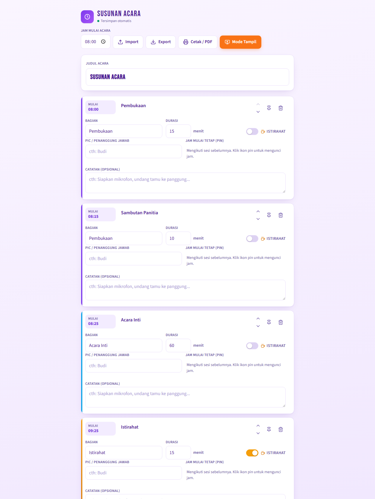
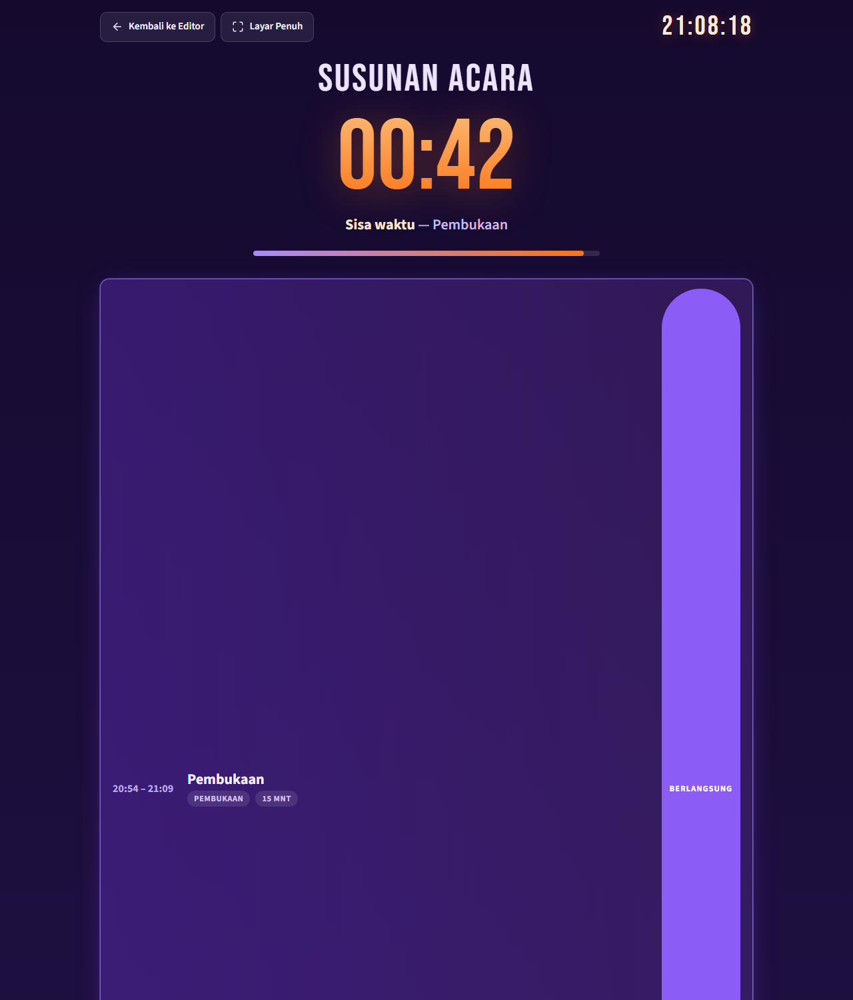
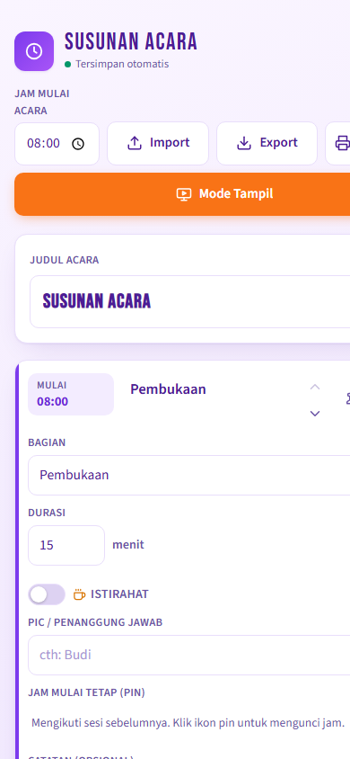

# Susunan Acara

Aplikasi web untuk **membuat dan mengatur susunan acara** berdasarkan waktu — editor rundown dengan jam otomatis, mode tampil live untuk proyektor, export/import JSON, dan cetak/PDF. Berupa **PWA**: bisa di-install di HP dengan ikon sendiri dan berjalan layar penuh (bahkan offline).

## Cuplikan

| Mode editor | Mode tampil (live) | Editor di HP |
|---|---|---|
|  |  |  |

## Cara pakai

- **Langsung:** buka `index.html` di browser (HP/laptop). Semua fitur editor jalan normal; data tersimpan otomatis di browser.
- **Mode tampil langsung:** tambahkan `?tampil` di akhir URL (mis. `https://…/index.html?tampil`) agar langsung terbuka ke mode live — cocok sebagai bookmark/tautan untuk layar proyektor.
- **PWA / instalasi / offline:** butuh di-host lewat **HTTPS** (atau `localhost`). Service worker tidak aktif jika dibuka dari `file://`.

## Hosting di GitHub Pages

1. Buat repo baru di GitHub (contoh: `rundown-acara`).
2. Unggah seluruh isi folder ini ke repo (ada tombol **Add file → Upload files** di halaman repo, atau pakai git).
3. Buka **Settings → Pages**.
4. Pada **Build and deployment**, pilih *Deploy from a branch* → branch `main` → folder `/ (root)` → **Save**.
5. Tunggu 1–2 menit, lalu buka alamatnya: `https://<username>.github.io/<nama-repo>/`
   (Semua path di aplikasi relatif, jadi aman berada di sub-folder seperti ini.)

## Hosting di Netlify (paling cepat)

1. Buka **https://app.netlify.com/drop** (login dulu bila diminta).
2. **Tarik dan letakkan** folder proyek ini ke halaman itu.
3. Selesai — Netlify memberi alamat `https://<nama>.netlify.app` otomatis.
   (Cara ini untuk sekali unggah; untuk update rutin, hubungkan repo git lewat *Add new site → Import an existing project*.)

## Install di HP

**Android (Chrome/Edge):**
1. Buka URL yang sudah di-host di browser.
2. Ketuk tombol **Pasang** di aplikasi — atau menu browser ⋮ → **Add to Home screen / Install app**.
3. Aplikasi muncul di layar utama dengan ikon jam ungu.

**iPhone (Safari):**
1. Buka URL di Safari.
2. Ketuk tombol **Share** (⬆️) → **Add to Home Screen**.
3. Konfirmasi — aplikasi terbuka tanpa address bar.

## Coba lokal (tanpa hosting)

```bash
python -m http.server 8000
```

Lalu buka `http://localhost:8000` — service worker aktif di localhost, jadi instalasi & offline bisa diuji di komputer.

## Catatan

- **Update:** setiap ada perubahan file, cukup deploy ulang; browser akan memakai versi baru (navigasi utamakan jaringan). Kalau versi lama masih muncul, muat ulang halaman sekali.
- **Data** tersimpan di browser per perangkat. Pindah HP? Gunakan tombol **Export** (file JSON) → **Import** di perangkat baru.
- Ikon bisa di-generate ulang: `python tools/generate_icons.py`.
